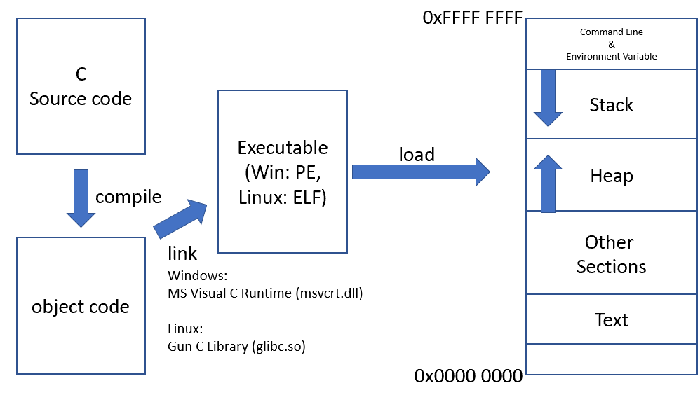
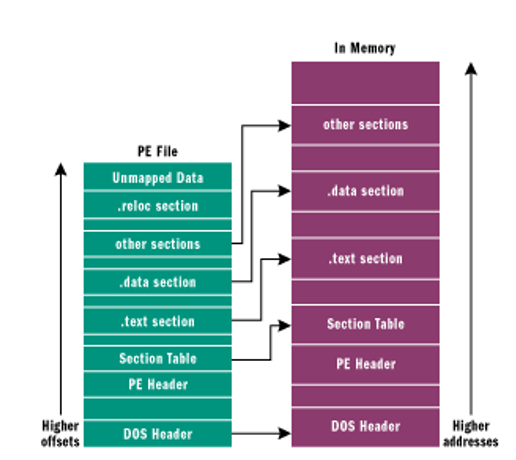
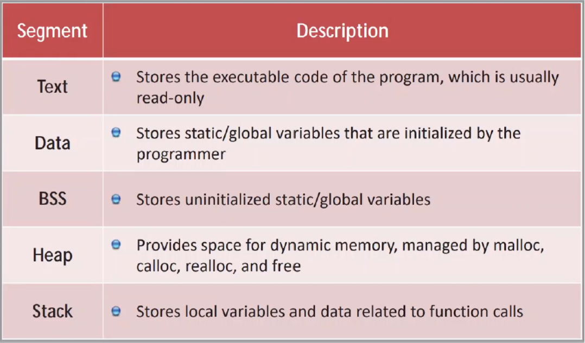

PWN
===

# 前言
```
C語言是創造作業系統的語言(ex.Unix)，有其不可替代性，因為它是創造電腦世界的基礎
```

# Execuable




Windows
```
- 在windows中的程式鑰成功執行，檔案對、設定也要對
- MS Visual C Runtime (msvcrt.dll) : 打包了微軟所有C語言的函式實做
- 當msvcrt.dll missing時，我們就需要去下載 C++可轉散發套件
  但到底哪一版只有寫程式的那個人知道
- cygwin : 把整個Linux的開發環境(Runtime)原封不動的跑到windows底下執行
```

Linux
```
- Gun C Library(glibc.so)
- Wine(Wine is not an Emulator) : 把Windows執行環境(Runtime)搬到Linux，把msvcrt寫成Linux版本
```
# Memory
```
2**32 = 4G
```


# Assembly
```
AT&T  => 大端序
Intel => 小端序

組譯 => 注音變中文
編譯 => 中文翻成英文
```

# StackFrame
Stack
```bash 
# Save EBP往上開始才是新的stack frame


Local Var  
#<---New Function Frame
Save EBP
ret addr
Arg1
Arg2 
# ----main----
```

# Function
Function Prologue
```asm
PUSH %EBP
MOV %ESP, %EBP
SUB  n, %ESP
```
Function Epilogue
```asm
MOV %EBP, %ESP
POP %EBP
RET
```

# PEDA
```bash
git clone https://github.com/longld/peda.git ~/peda
echo "source ~/peda/peda.py" >> ~/gdbinit
echo "DONE! debug your program with gdb and enjoy"
```

# Challenge
Lab Enviroment
```
Module 13 : Binanry Analysis and Exploitation
Software-Test-Linux-32bits

Kevin-32bit
studentpassword
```
1. [crackme0x00a](./Challlenge/1.crackme0x00a.md)
2. [shellcode](./Challlenge/2.shellcode.md)
3. [BOF](./Challlenge/3.ret2sc.md)
4. [NX](./Challlenge/4.ret2libc.md)
5. [Static-ROP](./Challlenge/5.Static-ROP.md)
6. [ROP](./Challlenge/6.ROP.md)