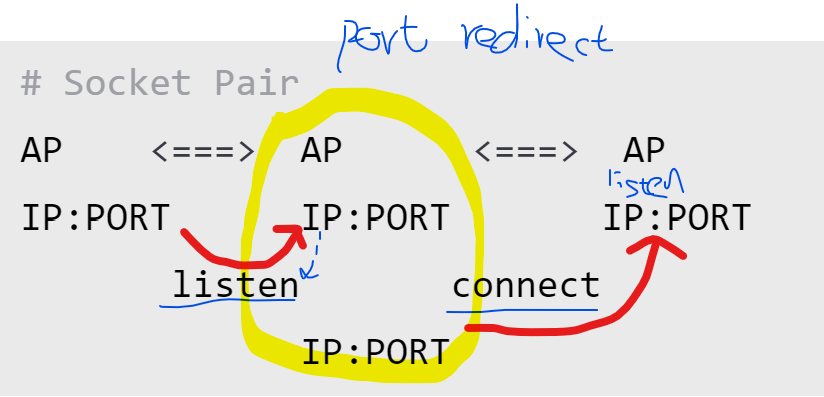
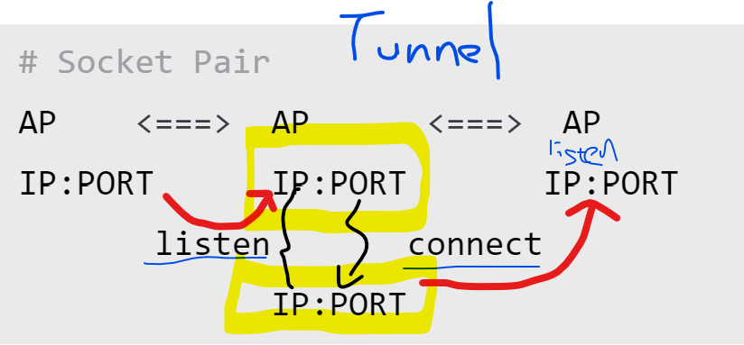

P&DP
===
> Port Fowarding / proxy /redirection Tunneling
```bash
# Socket : IP:port 
# socket是抽象化的表現
# 把網路世界包裝成一個插頭介面

# Socket Pair
AP    <===>  AP      <===>  AP 
IP:PORT      IP:PORT       IP:PORT
       listen       connect
             IP:PORT
```
> 兩個服務


> 兩台機器


# SSH Port Forwarding
```bash
# 看是誰開port就是local 或 remote
# Local
sudo ssh administrator@192.168.0.70 -L *:80:192.168.0.24:80
sudo netstat -antp | grep :80

sudo watch netstat -antp

# Remote
nano /etc/ssh/sshd_config # GatewayPorts yes
ssh administrator@192.168.0.70 -L *:8008:192.168.0.24:80


# Dynamic
whereis proxychains
cat /usr/bin/proxychains3
# Proxy Server <===> ProxyChains  | API Hooking(6個API 範圍內才可以處理) 
ssh -D 9050 administrator@192.168.0.70

```

# DP
```bash
ssh -J administrator@192.168.0.70 administrator@192.168.0.10 -L *:80:192.168.0.24:80
```

# Port Forwarding
```bash
# Socat 
# 可轉發UDP
# Socat Static Binanry
host goo.gle 127.0.0.1


# Datapipe
# bovine/datapipe
smbclinet //172.19.19.20/c$ -U 'administrator%'

gcc datapipe.c -o datapipe

datapipe 0.0.0.0 135 192.168.0.7 135
datapipe 0.0.0.0 445 192.168.0.7 445
datapipe 0.0.0.0 4444 172.19.19.18 4444


# Windows
Portproxy #需要local admin權限

```

# Meterpreter
```bash
sudo ifconfig eth0 down

# session routung
msfconsole -q

search sshexec
use 0
show options

set rhosts 172.19.19.70
set lhost 172.19.19.18

# gateway seesion

```

# Chisel
```bash
ssh over wss over HTTP
```