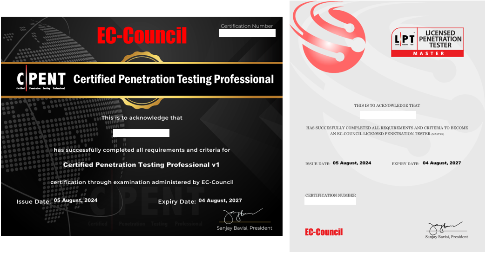
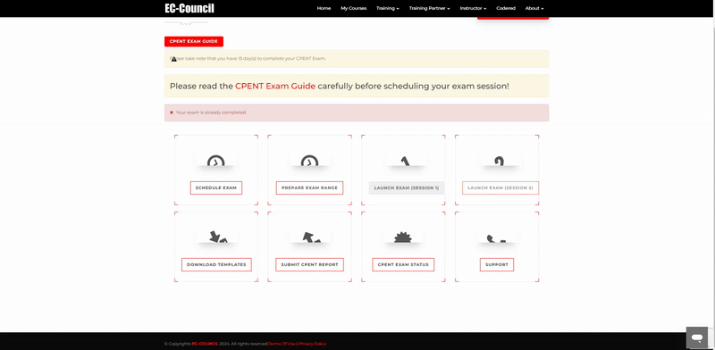

CPENT 
===

🔙 [HOME](../../HOME.md)

# Certificate



---

# Exam Reflections
- **前言**
在2023年年底報名了恆逸的CPENT課程，因為一年後準備考OSCP打算拿CPENT先練練手找找考試的感覺，大概研究了一下雖然範圍廣但都是一定的出題模式，加上身邊不少的滲透還是一般的網管人員都有拿取這張證照，所以就以LPT為目標去準備。想說考不到的話OSCP也不用想了。

- **上課**
上過恆逸課程或者是資安圈的大概都知道是哪個老師來上課，老師上的很不錯，要認真聽並且把每個練習跟精選的iLab做一次，還有老師的筆記也很有用，因為iLab有180天的期限所以回去後可以抽出一點時間在實做一次，個人是拖延症所以拖了半年才去考，一起上課的人很多都考過了我才去考，考試是一年內要考完記得不要過期。

- **考試**
考試分成12小時兩次或者24小時一次，考過的人通常會推薦12小時兩次的方案，一方面精神壓力比較小，一方面兩次考試中間可以針對不確定的題目去做一些複習跟求救，所以我也是選擇了12小時的方案，特別在北部找了一間空房做考試，等考試面板的倒數計時結束，點進去照步驟做就可以完成監考，我是使用kali做為主要攻擊機，然後用OpenVPN去連線考場環境。

   **針對一些人可能會有的問題:**   
   ```
   1. 考試的時段怎麼選?
      基本上要提前三天預約考試，考試時間通常是重中午12-13開始往後加12小時，所以基本上是中午到半夜
   2. 可以一邊聽音樂嗎?
      我遇到的考官是不行，但也有聽說有遇到可以的，可以透過小聊天窗提出你的訴求
   3. 可以一邊吃東西嗎?
      在詢問完考官後，他的意思是不離開螢幕都可以不用跟他說，所以我在鏡頭前大嗑漢堡
   4. 可以上廁所嗎?
      跟考官說就可以，但不要離開太久，回座位也記得說一聲
   5. 可以使用雙螢幕嗎?
      是說不行，但也是有聽說把主螢幕關掉指接擴大螢幕的，自行斟酌，我是乖乖盯著我的小筆電
   ```
- **考試小提醒**
  1. 一邊做答一邊截圖，要不然真的會忘記
  2. 不一定真的乖乖提權，有時候內核類的提權也可以達到你要的結果
  3. 可以的話去調整一下字典檔的順序，要不然你需要暴力破解非常久
  4. 有些人可能從網路上搞到海盜版的解答，但一定要依實機狀況做調整
     解答只是一個做法，我就遇到需要與在與解答不同IP上才能找到需要的資訊
     所以不要跟著解答的指令無腦下，還是要好好探索網路環境，不然做起來真的很不合理
  5. 可以提早結束考試，我第二個12小時只做了四小時就交了，只要確定需要的資訊截圖都有留下
  6. 每個題組作答完畢記得都按儲存答案

- **成績**
考完後七天內需要繳交你的滲透測試報告，儀表板上有模板可以下載，記得是七天內要不然你需要多交100美元的延長金，不太划算。這邊就要講個遇到的坑，我的儀表在我第五天要繳交報告按下送出按鈕時，畫面只有轉了一下，沒有任何反應，也沒有說報告上傳成功，這時候請你毫不吝嗇的爆Call他們的客服，我自己是寄信加上ChatBox瘋狂轟炸，因為他們處理的時間確實不快，超過七天要不要多交錢沒人知道，後來團隊是要我直接把報告寄給他們就好，記得要再去追問你的報告狀態，真的有上到儀表的時候你會很清楚地知道你的報告已經在審核，所以為了自己權益還是好好的追蹤。



---


# Exam
1. 教材
   - ASPEN課程序號開通
   - 電子教材(一年期限)
   - 收到Email信箱
     ilabs Training (Access) Key
   - iLab靶機環境(180天)
     https://eccouncil.learnondemand.net/
2. 考試
   - 課程序號開通
   - Exam Dashboard便會開通(一年期限)
   - 預約考試後30天內需完成考試，沒考的連補考都沒有機會
   - 真的出事沒有考到，請洽恆逸補考卷
3. 考試時間
   - 需準備護照
   - 只能是平日上班日考
   - 考試選擇，選好不能改
     - 12 + 12 (間隔只要在30天內就可以)
     - 24
   - PenTest Report(7天內需繳交)
   - CPENT:70% 、 LPT:90%
   - 500*(分) * 5(大題) = 2500
   - Launch Exam -> OpenVPN -> Exam Range
   - 考試當天計時畫面需要掛著
   - 只能使用單螢幕考，MAC虛擬桌面也不可以，需要meeting可以錄影錄的到
4. 考試內容(5大題)
   - 選擇題
     - 大約55題選擇題，每大題約8-12題
     - 需要尋找的資訊包含:版本、金鑰、密碼、flag
   - 滿分 2500
   - 題型
     - AD (500)
     - Binary exploitation + IOT (500)
     - CTF (500)
     - OT (500)
     - Pivot & Double Pivot (500)
5. 證照延續
   - ECE : US120/3年
   - 年費 : US250/年
     可以開個apsen小號，讓年費維持US80/年

---


# NOTE
分類與整理的筆記，直接點擊連結跟返回切換頁面，不需要再去另外找目錄檔案
1. Penetration Test
   - [Scan](1.Penetration%20Test/Penetration%20Test%20-%20Scan%20.md)
     - IP Scan
     - Port Scan
     - Service Scan
   - [Enumeration & Service](1.Penetration%20Test/Penetration%20Test%20-%20Enumeration%20&%20Service.md)
     - SNMP
     - NetBIOS & NetBT
     - CIFS / SMB
     - RDP
     - SSH
     - Windows Access
     - OWASPBWA
   - [Privilege Escalation](1.Penetration%20Test/Penetration%20Test%20-%20Privilege%20Escalation.md)
     - MS17-010
     - Sudo
     - PwnKit
     - DirtyCow
     - Egress Busting (Remote Control)
     - Persistent
2. [OT](./2.OT/OT.md)
   - OT
   - tcpdump
   - Analyze
   - Modbus
   - ModbusAnalog
3. [IOT](./3.IOT/IOT.md)
   - Enviroment
   - Find Something
   - Dlink_firmware.bin
   - D6000-V1.0.0.41_1.0.1.bin
   - encrypted.bin
   - encrypted.bin - XORTool
4. [Pivot & Double Pivot](./4.Pivot%20&%20Double%20Pivot/Pivot%20&%20Double%20Pivot.md)
   - Enviroment
   - 4-Ways
     - SSH port forwarding (SSH Tunneling)
     - Port forwarding
     - Meterpreter
     - Chisel
5. [PWN](./5.PWN/PWN.md)
   - Foreword
   - Execuable
   - Memory
   - Assembly
   - StackFrame
   - Function
   - PEDA
   - Challenge
6. AD Pentest
   - [AD](./6.AD%20Pentest/AD.md)
     - Tree 、 Forest
     - Manager
     - AD
     - Penetration
       - [Recon](./6.AD%20Pentest/Recon.md)
       - [Kerberos](./6.AD%20Pentest/Kerberos.md)
         - Export Kerberos Tickets
         - Pass The Ticket
         - Golden Ticket Attack (TGT)
         - Kerberoasting
         - Zerologon
         - Sliver Ticket Attack (TGST)
7. [WEB RCE](./7.Web%20to%20RCE/Web%20to%20RCE.md)
   - SHELLSHOCK
   - LFI to RCE
   - PHP_SESSION_UPLOAD_PROGRESS
   - WordPress - LFI

